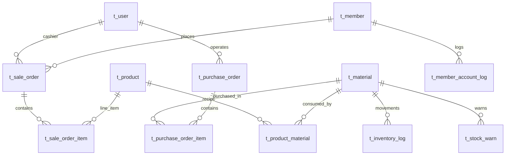

## 中小型茶饮店会员与进销存一体化管理系统

## 一、数据库总体设计概览（精简版）

> 在仍能支撑 **采购、库存、收银下单扣配料、会员与储值积分、报表视图、库存预警触发器、员工登录** 的前提下，将表数量从约 21 张压缩为 **12 张**。  
> 命名尽量与现有前端 `index.js` 中的概念对齐：`material`（原料）、`sale_order`（销售订单）、商品带 `category` 字符串等。

### 精简原则

| 做法 | 说明 |
|------|------|
| 去掉独立分类表 | 分类用 `t_product.category` 字符串（如 奶茶/果茶），与前端筛选一致 |
| 原料+库存合一 | `t_material` 同时存原料档案与 `stock_quantity`、`safety_stock` |
| 供应商不入库 | 采购单上仅存 `supplier_name` 文本，满足录入与列表即可 |
| 会员等级不入库 | `t_member.level` 用 1/2/3，折扣率由后端代码配置（与前端一致） |
| 流水各并一张 | 会员余额/积分合并为 `t_member_account_log`；库存变动统一 `t_inventory_log` |
| 去掉营销活动表 | 前端当前按会员等级算优惠，订单只存 `discount_amount` |
| 权限极简 | 仅 `t_user`，`role` 字段区分角色，不做菜单权限表 |

---

## 二、表清单与主要字段（共 12 张）

### 2.1 用户与登录

**1. `t_user`（登录用户，对应收银员/店长等）**

| 字段 | 说明 |
|------|------|
| `id` | 主键 |
| `phone` | 登录手机号（唯一，与前端登录一致） |
| `password` | 密码（加密） |
| `name` | 姓名 |
| `role` | 角色：`ADMIN` / `CASHIER` 等（varchar，够用即可） |
| `status` | 1 正常 / 0 停用 |
| `create_time`，`update_time` | |

---

### 2.2 商品与配方

**2. `t_product`（在售商品）**

| 字段 | 说明 |
|------|------|
| `id` | 主键 |
| `name` | 商品名 |
| `category` | 分类字符串（奶茶/果茶/咖啡/甜品），供前端 `filterProducts` |
| `sale_price` | 售价（与前端 `sale_price` 一致） |
| `status` | 1 上架 / 0 下架（`GET /api/product?status=1`） |
| `image_url` | 可选 |
| `create_time`，`update_time` | |

**3. `t_material`（原料 = 原「配料」+ 库存）**

| 字段 | 说明 |
|------|------|
| `id` | 主键 |
| `name` | 原料名称 |
| `unit` | 单位 |
| `stock_quantity` | 当前库存（采购入库、下单扣减、盘点都改此字段） |
| `safety_stock` | 安全库存（低于则触发预警；前端 `is_low` 可由查询计算） |
| `status` | 1 启用 / 0 停用 |
| `updated_at` | 最近变更时间 |

**4. `t_product_material`（商品–原料配方：每杯消耗量）**

| 字段 | 说明 |
|------|------|
| `id` | 主键 |
| `product_id` | → `t_product.id` |
| `material_id` | → `t_material.id` |
| `consume_qty` | 每份商品消耗该原料数量 |

> 下单事务：按订单明细 × `consume_qty` 扣减 `t_material.stock_quantity`。

---

### 2.3 采购

**5. `t_purchase_order`（采购单主表）**

| 字段 | 说明 |
|------|------|
| `id` | 主键 |
| `order_no` | 采购单号（唯一） |
| `supplier_name` | 供应商名称（文本，不建供应商表） |
| `total_amount` | 总金额 |
| `status` | 0 待入库 / 1 已入库 / 2 已取消（与前端采购状态一致） |
| `operator_id` | 操作人 → `t_user.id`（可空） |
| `created_at` | 创建时间 |
| `inbound_at` | 入库时间（可空） |

**6. `t_purchase_order_item`（采购明细）**

| 字段 | 说明 |
|------|------|
| `id` | 主键 |
| `purchase_order_id` | → `t_purchase_order.id` |
| `material_id` | → `t_material.id` |
| `quantity` | 数量 |
| `unit_price` | 单价 |
| `subtotal` | 小计 |

---

### 2.4 销售订单（收银）

**7. `t_sale_order`（销售订单主表，与前端 `sale_order` 对应）**

| 字段 | 说明 |
|------|------|
| `id` | 主键 |
| `order_no` | 订单号（唯一） |
| `member_id` | → `t_member.id`，散客可空 |
| `total_amount` | 商品原价合计 |
| `discount_amount` | 优惠金额 |
| `pay_amount` | 实付 |
| `pay_type` | 1 现金 / 2 微信 / 3 支付宝 / 4 余额 |
| `status` | 1 已完成 / 0 已取消 等 |
| `cashier_id` | → `t_user.id` |
| `created_at` | 下单时间 |

**8. `t_sale_order_item`（销售明细）**

| 字段 | 说明 |
|------|------|
| `id` | 主键 |
| `sale_order_id` | → `t_sale_order.id` |
| `product_id` | → `t_product.id` |
| `product_name` | 快照 |
| `unit_price` | 快照 |
| `quantity` | 数量 |
| `subtotal` | 小计 |

> **事务**：写入主从表 + 扣 `t_material` + 更新会员余额/积分 + 写 `t_member_account_log` / `t_inventory_log`（按实现取舍是否每笔都记 log）。

---

### 2.5 会员

**9. `t_member`（会员）**

| 字段 | 说明 |
|------|------|
| `id` | 主键 |
| `phone` | 唯一 |
| `name` | 姓名 |
| `level` | 1 普通 / 2 银卡 / 3 金卡（与前端一致） |
| `balance` | 储值余额 |
| `points` | 积分 |
| `total_consume` | 累计消费（前端列表展示） |
| `status` | 1 正常 / 0 冻结 |
| `created_at`，`updated_at` | |

**10. `t_member_account_log`（会员账务流水，合并原余额流水+积分流水）**

| 字段 | 说明 |
|------|------|
| `id` | 主键 |
| `member_id` | → `t_member.id` |
| `biz_type` | 如 `RECHARGE` / `ORDER_PAY` / `ORDER_POINTS` 等 |
| `delta_balance` | 余额变动（可 0） |
| `delta_points` | 积分变动（可 0） |
| `balance_after` | 变动后余额（便于对账） |
| `points_after` | 变动后积分 |
| `ref_sale_order_id` | 关联订单，可空 |
| `remark` | 备注 |
| `created_at` | |

---

### 2.6 库存流水与预警

**11. `t_inventory_log`（库存流水，采购入库、销售扣料、盘点调整统一记一条）**

| 字段 | 说明 |
|------|------|
| `id` | 主键 |
| `material_id` | → `t_material.id` |
| `change_qty` | 正数入库、负数出库 |
| `after_stock` | 变动后库存 |
| `biz_type` | `PURCHASE_IN` / `SALE_OUT` / `ADJUST` 等 |
| `ref_id` | 关联采购单或销售单 id，可空 |
| `type_name` | 展示用中文说明（与前端 `type_name` 对齐） |
| `created_at` | |

**12. `t_stock_warn`（库存预警记录，供触发器写入，满足课程「触发器」）**

| 字段 | 说明 |
|------|------|
| `id` | 主键 |
| `material_id` | → `t_material.id` |
| `current_qty` | 触发时库存 |
| `safe_qty` | 触发时安全库存 |
| `warn_time` | 预警时间 |
| `handled` | 0 未处理 / 1 已处理（可选） |

> **触发器**：在 `t_material` 的 `stock_quantity` 更新后，若 `stock_quantity < safety_stock`，向 `t_stock_warn` 插入一行（或按课程要求合并逻辑）。

---

### 2.7 视图（仍满足课程要求，不增加基表）

- **`v_daily_sales`**：按日汇总订单数、金额、优惠、实收、按支付方式拆分等（供 `/api/v_daily_sales`）。
- **`v_product_rank`**：商品销量排行（供 `/api/v_product_rank`）。

视图字段名可与前端 `index.js` 中 `renderDailyReport` / `renderProductRank` 使用的属性一致（如 `sale_date`、`total_sold`、`order_count` 等），具体在 `views.sql` 中定义。

---

## 三、精简后 ER 图（Mermaid）

---

## 四、与前一版对比（删掉了什么）

| 删除/合并项 | 处理方式 |
|-------------|----------|
| `t_category` | 并入 `t_product.category` |
| `t_ingredient` + `t_stock` | 合并为 `t_material` |
| `t_supplier` | 采购单 `supplier_name` |
| `t_stock_check` | 盘点写入 `t_inventory_log` + 更新 `t_material` |
| `t_member_level` | `t_member.level` + 代码里折扣率 |
| `t_member_balance_log` + `t_member_points_log` | 合并为 `t_member_account_log` |
| `t_promotion` | 暂不建表；优惠只记订单金额字段 |
| `t_order` / `t_order_item` | 改名为 `t_sale_order` / `t_sale_order_item`（与前端语义一致） |
| `t_employee` + `t_role` + `t_menu` + `t_role_menu` | 合并为 `t_user` + `role` |

---

## 五、后续工作说明

1. 在 `db/schema.sql` 中按本精简版建表；外键可按课程要求选择「逻辑外键」或真实 `FOREIGN KEY`。  
2. `db/views.sql`：`v_daily_sales`、`v_product_rank` 等。  
3. `db/triggers.sql`：针对 `t_material` 更新 `stock_quantity` 的预警触发器。  
4. 若某门课强制要求「单独盘点表」，可仅增加一张 `t_stock_check` 记录盘点快照，仍比原 21 张表少得多。

---

**文档版本**：V2.0（精简版）
